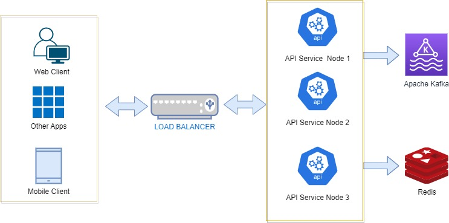

# Solution Overview
This document serves as a high-level description of our API Design Guidelines and imlementation approach for the technical challenge at Smaato


## Functional Requirements
The following are the proposed list of functional requirement to be implemented on the System:

1. The service has one GET endpoint - /api/smaato/accept which is able to accept an integer id as a mandatory query parameter and an optional string HTTP endpoint query parameter. It should return String “ok” if there were no errors processing the request and “failed” in case of any errors.
2. Every minute, the application should write the count of unique requests your application received in that minute to a log file - please use a standard logger. Uniqueness of request is based on the id parameter provided.
3. When the endpoint is provided, the service should fire an HTTP GET request to the provided endpoint with count of unique requests in the current minute as a query parameter. Also log the HTTP status code of the response.scenarios in line with the SOLID principle and separation of concerns.
4. Instead of firing an HTTP GET request to the endpoint, fire a POST request. The data structure of the content can be freely decided.  
5. Instead of writing the count of unique received ids to a log file, send the count of unique received ids to a distributed streaming service of your choice. 

## Non Functional Requirements
The following are the proposed list of Non-functional requirement to be implemented on the System:

1. Ability to process 10K requests per Second
2. Implement deduplication to avoid duplication
3. Implement Tracing - observability




Once the alarm is triggered, it send the message to the Lambda through the SNS Topic, which now uses the AWS SDK v2 to Fetch the TaskDefinition object, modified the CPU and Memory,update the Service with the New task which will then create a new version.


## Build and Deployment

For the Source to build, it requires the following Software requirments as well as AWS ACCESS AND SECRET KEYS. Also ensure the Environmental variables are set and their HOME defined on their PATHs.

* [Java SE Development Kit 8 installed](http://www.oracle.com/technetwork/java/javase/downloads/jdk8-downloads-2133151.html)
* [Maven](https://maven.apache.org/install.html)
* [TerraForm installed](https://developer.hashicorp.com/terraform/downloads?product_intent=terraform)


Firstly,from the command prompt/Terminal clone the repository with git command or download (directly from Github) the project  into a directory and change directory
```bash
git clone https://github.com/ezechima123/aws-ecs-vertical-autoscaling-task.git

cd aws-ecs-vertical-autoscaling-task
```


Secondly,I have to use `maven` to install our dependencies and package our application into a JAR (ecs-vertical-autoscale-lambda-1.0.0-SNAPSHOT.jar) file:
```bash
mvn clean verify package

This will create the jar file on the target folder
```

Thirdly, I set the AWS Access Keys on my Windows Environment PATH as shown below as the Terramform builds is dependent on it:
```bash
WINDOWS 
set AWS_ACCESS_KEY_ID=your_access_key_id
set AWS_SECRET_ACCESS_KEY=your_secret_access_key
set AWS_REGION=your_aws_region

UNIX/LINUX
export AWS_ACCESS_KEY_ID=your_access_key_id
export AWS_SECRET_ACCESS_KEY=your_secret_access_key
export AWS_REGION=your_aws_region
```

Fourthly, I ran the Terraform builds to create the Resources(Cluster,Task,Services) as shown below:
```bash
cd terraform
terraform init
terraform plan
terraform validate
terraform apply --auto-approve
```
If all goes well, the resources will be created on your AWS


## Further Enhancements
The following are other enhancements that can be done on the system to improve the production ability of the process:

1. Creating a DeploymentScript or a Ci/Cd pipeline to automating the whole process
2. Improving the CPU-Memory selection algorithm to avoid Invalid CPU or memory value specified error
3. Creating two different Lambda Handlers (CpuUtilizationHandler and MemoryUtilizationHandler) to handle different scenarios in line with the SOLID principle and separation of concerns.
4. Enhance the Terraform scripts and add resources for Cloudwatch Alam/Sns Topics 
5. Enhance the Terraform scripts and add resources for upload Lambda Jar file to AWS and Setup


